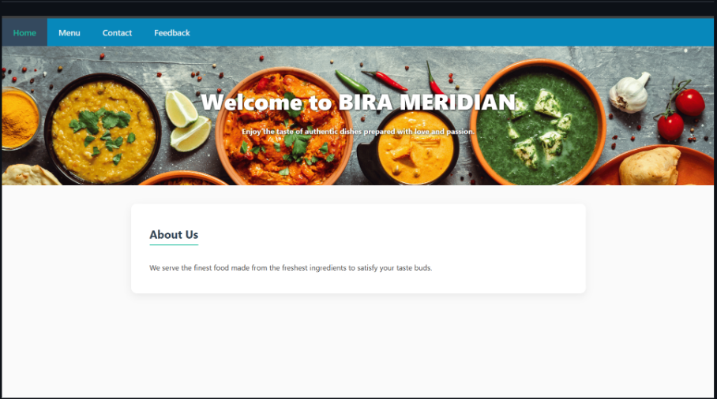
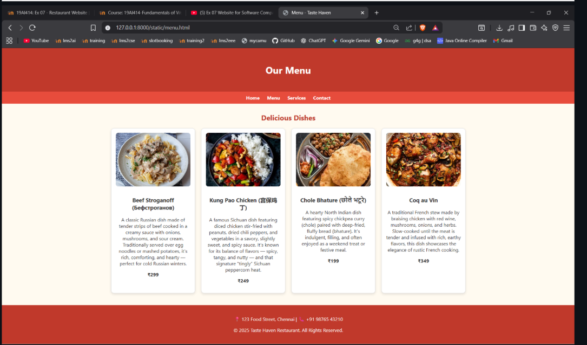
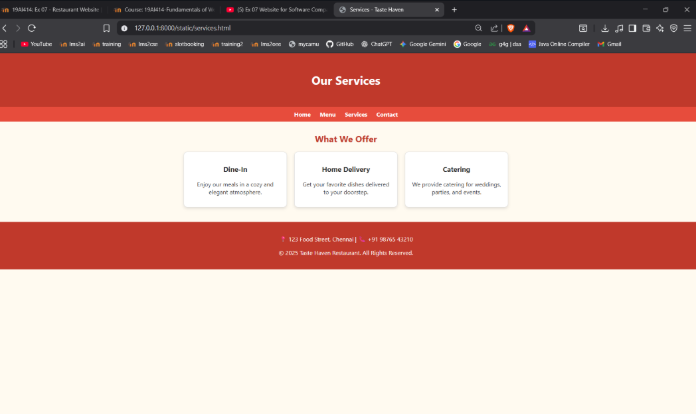
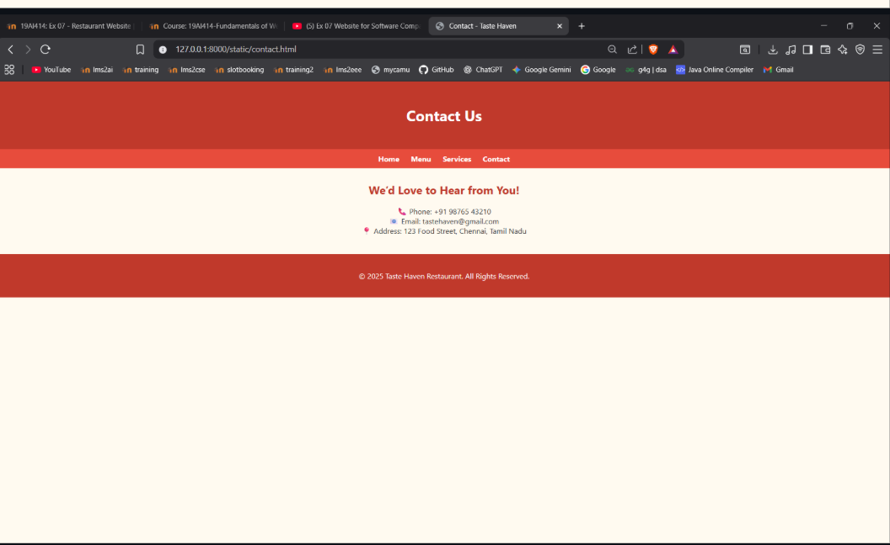

# Ex.07 Restuarant Website
## Date:

## AIM:
To develop a static Resturant website to display the menu and services provided by the resturant.

## DESIGN STEPS:

### Step 1:
Requirement collection.

### Step 2:
Creating the layout using HTML and CSS.

### Step 3:
Updating the sample content.

### Step 4:
Choose the appropriate style and color scheme.

### Step 5:
Validate the layout in various browsers.

### Step 6:
Validate the HTML code.

### Step 7:
Publish the website in the given URL.

## PROGRAM:
```
<!DOCTYPE html>
<html lang="en">
<head>
    <meta charset="UTF-8" />
    <title>BIRA MERIDIAN - Home</title>
    <link rel="icon" href="logos.jpg">
    <style>
        body {
            font-family: 'Segoe UI', Tahoma, Geneva, Verdana, sans-serif;
            margin: 0;
            background: #fafafa;
            color: #333;
        }
        .navbar {
            background: #0788bb;
            overflow: hidden;
            box-shadow: 0 3px 6px rgba(0,0,0,0.16);
        }
        .navbar a {
            float: left;
            color: #ecf0f1;
            text-align: center;
            padding: 18px 24px;
            text-decoration: none;
            font-size: 18px;
            font-weight: 600;
            transition: background 0.3s;
        }
        .navbar a:hover, .navbar a.active {
            background: #34495e;
            color: #1abc9c;
        }
        .hero {
            background: url('https://images.unsplash.com/photo-1504674900247-0877df9cc836?auto=format&fit=crop&w=1350&q=80') no-repeat center center/cover;
            height: 300px;
            display: flex;
            align-items: center;
            justify-content: center;
            color: #fff;
            text-shadow: 1px 1px 4px #000;
            text-align: center;
            padding: 0 20px;
        }
        .hero h1 {
            font-size: 48px;
            margin: 0;
            font-weight: 900;
        }
        .container {
            max-width: 900px;
            margin: 40px auto;
            background: #fff;
            padding: 30px 40px;
            border-radius: 12px;
            box-shadow: 0 6px 18px rgba(0,0,0,0.07);
        }
        h2 {
            color: #2c3e50;
            margin-bottom: 20px;
            font-weight: 700;
            border-bottom: 3px solid #1abc9c;
            display: inline-block;
            padding-bottom: 6px;
        }
        
    </style>
</head>
<body>
    <div class="navbar">
        
        <a href="home.html" class="active">Home</a>
        <a href="menu.html">Menu</a>
        <a href="contact.html">Contact</a>
        <a href="feedback.html">Feedback</a>
    </div>

    <section class="hero">
        <div>
            <h1>Welcome to BIRA MERIDIAN</h1>
            <h4>Enjoy the taste of authentic dishes prepared with love and passion.</h4>
        </div>
    </section>
    <div class="container">
        <h2>About Us</h2>
        <p class="lead">We serve the finest food made from the freshest ingredients to satisfy your taste buds.</p>
        </div>
    </div>
</body>
</html>

<!DOCTYPE html>
<html lang="en">
<head>
  <meta charset="UTF-8">
  <title>Menu - Taste Haven</title>
  <link rel="stylesheet" href="style.css">
  <style>
    .card img {
      width: 100%;
      height: 180px;
      object-fit: cover;
      border-radius: 8px;
      margin-bottom: 10px;
    }
  </style>
</head>
<body>
  <header>
    <h1>Our Menu</h1>
  </header>

  <nav>
    <a href="index.html">Home</a>
    <a href="menu.html">Menu</a>
    <a href="services.html">Services</a>
    <a href="contact.html">Contact</a>
  </nav>

  <section class="container">
    <h2>Delicious Dishes</h2>
    <div class="menu">
      <div class="card">
        
        <h3>Beef Stroganoff (Бефстроганов)</h3>
        <p>A classic Russian dish made of tender strips of beef cooked in a creamy sauce with onions, mushrooms, and sour cream. Traditionally served over egg noodles or mashed potatoes, it’s rich, comforting, and hearty — perfect for cold Russian winters.</p>
        <p><b>₹299</b></p>
      </div>

      <div class="card">
        
        <h3>Kung Pao Chicken (宫保鸡丁)</h3>
        <p>A famous Sichuan dish featuring diced chicken stir-fried with peanuts, dried chili peppers, and vegetables in a savory, slightly sweet, and spicy sauce. It’s known for its balance of flavors — spicy, tangy, and nutty — and that signature “tingly” Sichuan peppercorn heat.</p>
        <p><b>₹249</b></p>
      </div>

      <div class="card">
        
        <h3>Chole Bhature (छोले भटूरे)</h3>
        <p>A hearty North Indian dish featuring spicy chickpea curry (chole) paired with deep-fried, fluffy bread (bhature). It’s indulgent, filling, and often enjoyed as a weekend treat or festive meal.</p>
        <p><b>₹199</b></p>
      </div>

      <div class="card">
        
        <h3>Coq au Vin</h3>
        <p>A traditional French stew made by braising chicken with red wine, mushrooms, onions, and herbs. Slow-cooked until the meat is tender and infused with rich, earthy flavors, this dish showcases the elegance of rustic French cooking.</p>
        <p><b>₹349</b></p>
      </div>
    </div>

    
  </section>

  <footer>
    <p>📍 123 Food Street, Chennai | 📞 +91 98765 43210</p>
    <p>© 2025 BIRA MERIDIAN. All Rights Reserved.</p>
  </footer>
</body>
</html>
<!DOCTYPE html>
<html lang="en">
<head>
  <meta charset="UTF-8">
  <title>Contact - Taste Haven</title>
  <link rel="stylesheet" href="style.css">
</head>
<body>
  <header>
    <h1>Contact Us</h1>
  </header>

  <nav>
    <a href="index.html">Home</a>
    <a href="menu.html">Menu</a>
    <a href="services.html">Services</a>
    <a href="contact.html">Contact</a>
  </nav>

  <section class="container">
    <h2>We’d Love to Hear from You!</h2>
    <p style="text-align:center;">
      📞 Phone: +91 98765 43210<br>
      📧 Email: tastehaven@gmail.com<br>
      📍 Address: 123 Food Street, Chennai, Tamil Nadu
    </p>
  </section>

  <footer>
    <p>© 2025 Taste Haven Restaurant. All Rights Reserved.</p>
  </footer>
</body>
</html>


body {
  font-family: 'Segoe UI', sans-serif;
  margin: 0;
  background-color: #fffaf0;
  color: #333;
}

header {
  background-color: #c0392b;
  color: white;
  text-align: center;
  padding: 30px 0;
}

nav {
  background-color: #e74c3c;
  display: flex;
  justify-content: center;
  gap: 25px;
  padding: 10px;
}

nav a {
  color: white;
  text-decoration: none;
  font-weight: bold;
}

nav a:hover {
  text-decoration: underline;
}

.container {
  width: 80%;
  margin: 30px auto;
}

h2 {
  text-align: center;
  color: #c0392b;
}

.card {
  background: #fff;
  border: 1px solid #ddd;
  border-radius: 10px;
  width: 250px;
  padding: 15px;
  text-align: center;
  box-shadow: 0 4px 8px rgba(0,0,0,0.1);
  transition: transform 0.2s;
}

.card:hover {
  transform: scale(1.05);
}

.menu, .services {
  display: flex;
  flex-wrap: wrap;
  justify-content: center;
  gap: 20px;
  margin-top: 20px;
}

footer {
  background-color: #c0392b;
  color: white;
  text-align: center;
  padding: 20px 0;
  margin-top: 40px;
}
```
## OUTPUT:

  
  
 
 

## RESULT:
The program for designing software company website using HTML and CSS is completed successfully.
